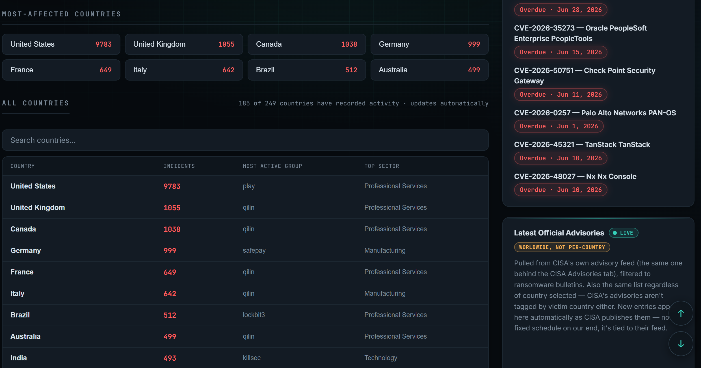
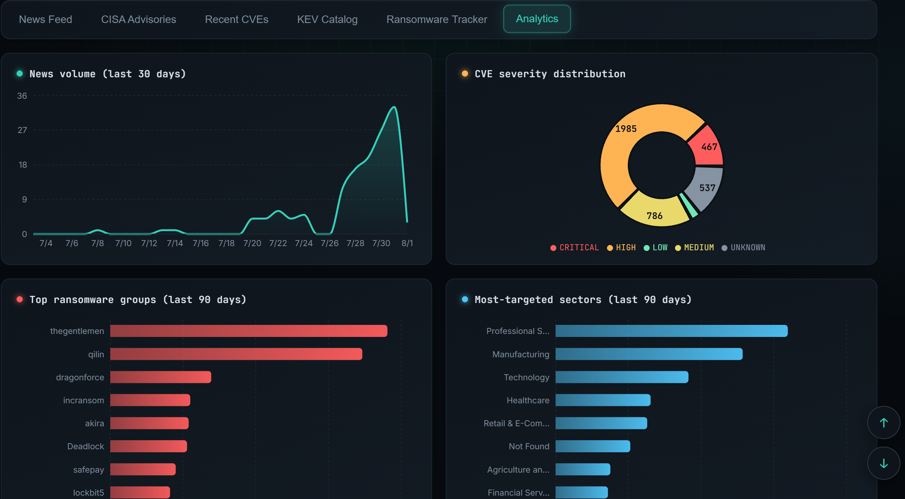
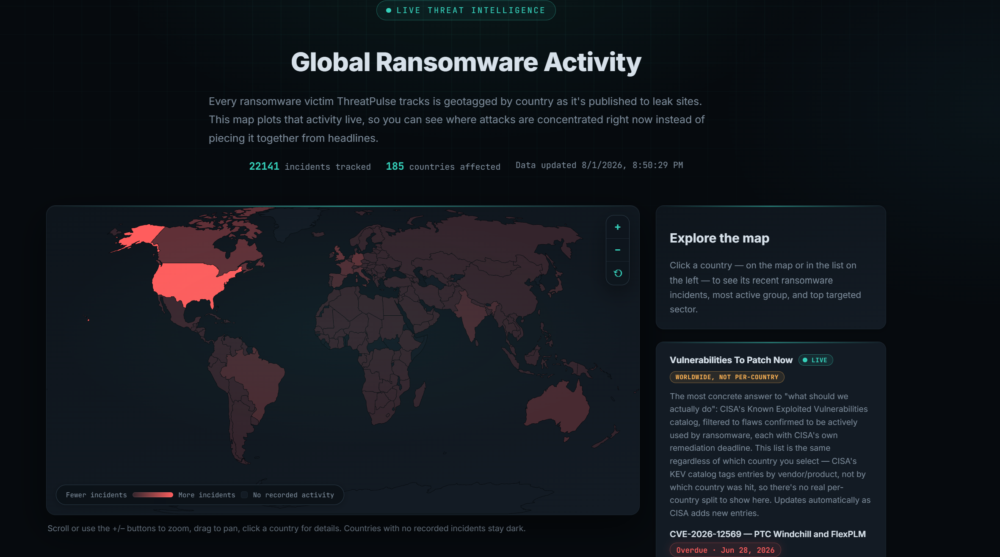

<h1 align="center">🛡️ ThreatPulse</h1>

<p align="center">
  <b>A self-updating cyber threat intelligence dashboard.</b><br/>
  Aggregates security news, CISA advisories, CVEs, exploited-vulnerability data, and ransomware activity into one place — with an IOC lookup tool and built-in analytics.
</p>

<p align="center">
  
  
  
  
  
  
  
</p>

<p align="center">
  <a href="#live-demo">Live Demo</a> ·
  <a href="#key-features">Features</a> ·
  <a href="#quick-start">Quick Start</a> ·
  <a href="#tech-stack">Tech Stack</a> ·
  <a href="#api-reference">API Reference</a>
</p>

---

## Why this exists

Security teams (and anyone tracking the threat landscape) have to check a dozen
different places — news sites, CISA's site, NVD, ransomware leak-site
trackers — just to stay current. **ThreatPulse pulls all of it into a single
dashboard**, refreshes itself on a schedule, and turns the raw feeds into
charts: severity breakdowns, top ransomware groups, targeted sectors, and
volume trends over time.

## Live Demo

**🔗 [threat-pulse-phi.vercel.app](https://threat-pulse-phi.vercel.app)**

## Key Features

- 📰 **Aggregated news** — pulls from The Hacker News, BleepingComputer, Krebs
  on Security, Dark Reading, SecurityWeek, and The Record
- 🏛️ **Official advisories** — live CISA advisories feed
- 🎯 **Known Exploited Vulnerabilities** — the CISA KEV catalog, flagged by
  ransomware association
- 🧬 **CVE tracking** — recent vulnerabilities from the NVD API with CVSS
  score and severity
- 🔓 **Ransomware tracker** — recent leak-site victim postings, searchable
  and paginated rather than dumped as one long list
- 🗺️ **Global threat map** — ransomware activity plotted by country, with
  drill-down into each country's most active group, top targeted sector,
  and recent incidents
- 📊 **Built-in analytics** — news volume, severity distribution, top
  ransomware groups, most-targeted sectors, KEV timeline — charted, not just
  listed
- ⏱️ **Self-updating** — background scheduler refreshes every source hourly
  (configurable), plus a manual "Refresh Now" button with live progress
  feedback and explicit "Last ingested / Next refresh" timestamps so it's
  always clear how current the data is
- 📡 **Live ticker** — the newest item across all five sources, typed out in
  real time on the landing page, so the dashboard reads as alive rather than
  static
- 🔍 **IOC Lookup** — paste a suspicious IP, domain, URL, or file hash and get
  a consolidated verdict: concurrent reputation checks against AbuseIPDB,
  VirusTotal, AlienVault OTX, and URLhaus (each behind a free, optional API
  key), correlation against ThreatPulse's own ingested news/advisories/
  ransomware data, an explainable point-based risk score with evidence-based
  escalation (and built-in recognition of known test files like EICAR, so it
  doesn't cry wolf on a security test), and rule-based, priority-tagged next
  investigation steps — validated client-side before it ever hits the
  backend, with results cached so repeat lookups are instant
- ✅ **Tested** — 57 automated tests (ingestion parsing, scoring/rule engine,
  and API layer), CI runs on every push
- 🐳 **Containerized** — one `docker compose up` gets the full stack running
  locally, database included

## Screenshots

<table>
  <tr>
    <td width="50%" align="center">
      <a href="docs/screenshots/hero.png"></a><br/>
      <sub>Landing page — live typing threat ticker</sub>
    </td>
    <td width="50%" align="center">
      <a href="docs/screenshots/dashboard-overview.png"></a><br/>
      <sub>Dashboard overview — live stat cards for every tracked source</sub>
    </td>
  </tr>
  <tr>
    <td width="50%" align="center">
      <a href="docs/screenshots/news-feed.png"></a><br/>
      <sub>News feed — six sources, searchable and filterable</sub>
    </td>
    <td width="50%" align="center">
      <a href="docs/screenshots/analytics.png"></a><br/>
      <sub>Analytics — volume, severity, top groups, most-targeted sectors</sub>
    </td>
  </tr>
  <tr>
    <td width="50%" align="center">
      <a href="docs/screenshots/threat-map.png"></a><br/>
      <sub>Global threat map — ransomware activity plotted by country</sub>
    </td>
    <td width="50%" align="center">
      <a href="docs/screenshots/country-directory.png"></a><br/>
      <sub>Country directory — searchable, with group and sector breakdown</sub>
    </td>
  </tr>
</table>

## Tech Stack

| Layer | Technology |
|---|---|
| Backend | FastAPI, SQLAlchemy, APScheduler |
| Frontend | React 19, React Router, Vite, Recharts, d3-geo + topojson (threat map) |
| Database | PostgreSQL (production) / SQLite (local dev) |
| Testing | Pytest, FastAPI TestClient |
| CI/CD | GitHub Actions |
| Deployment | Docker, Render, Vercel, Neon |

## Architecture

```
backend/    FastAPI + SQLAlchemy + APScheduler   -> REST API, background ingestion, analytics
frontend/   React + Vite + Recharts               -> dashboard UI
```

- **Ingestion split by design:** every data source has a `fetch_*()`
  function (does the network call) and a `process_*()` function (pure
  parsing/upsert logic, no network) — this is what makes ingestion unit
  testable offline, without hitting live APIs in CI.
- **Dedup by design:** all ingestion is upsert-based (matched on URL/CVE
  ID/etc.), so re-running it never creates duplicates.
- **Database-agnostic:** SQLite locally, Postgres in production — switched
  with a single `DATABASE_URL` environment variable, no code changes.
- **Resilient client-side aggregation:** the live ticker combines five
  independent API calls (news, advisories, CVEs, KEV, ransomware). Those are
  settled individually (`Promise.allSettled`, not `Promise.all`) so one slow
  or failing source — common on a free-tier host waking from cold — can't
  silently freeze the other four from updating.

## Quick Start

### Option A — Docker Compose (fastest, one command)

```bash
docker compose up --build
```

Starts Postgres, the backend (`localhost:8000`), and the frontend
(`localhost:5173`) together.

### Option B — run manually

**Backend:**
```bash
cd backend
python -m venv .venv
source .venv/bin/activate      # Windows: .venv\Scripts\activate
pip install -r requirements.txt
uvicorn app.main:app --reload --port 8000
```

**Frontend:**
```bash
cd frontend
npm install
cp .env.example .env
npm run dev
```

| Variable | Purpose | Default |
|---|---|---|
| `DATABASE_URL` | Postgres connection string (falls back to local SQLite if unset) | _(sqlite)_ |
| `UPDATE_INTERVAL_HOURS` | How often the scheduler re-fetches all sources | `1` |
| `NVD_API_KEY` | Free key from nvd.nist.gov, raises the CVE API rate limit | _(none)_ |
| `CVE_LOOKBACK_DAYS` | How many days back to pull modified CVEs | `3` |
| `ABUSEIPDB_API_KEY` | Free key from abuseipdb.com — powers IOC Lookup's IP reputation check | _(none — provider skipped gracefully)_ |
| `VIRUSTOTAL_API_KEY` | Free key from virustotal.com — powers IOC Lookup's multi-engine scan results | _(none — provider skipped gracefully)_ |
| `OTX_API_KEY` | Free key from otx.alienvault.com — powers IOC Lookup's threat-pulse correlation | _(none — provider skipped gracefully)_ |
| `URLHAUS_AUTH_KEY` | Free "Auth-Key" from auth.abuse.ch — powers IOC Lookup's known-malware-URL check | _(none — provider skipped gracefully)_ |
| `IOC_CACHE_TTL_MINUTES` | How long an IOC Lookup result stays cached before re-querying | `60` |

IOC Lookup works out of the box with no keys at all — correlation against
ThreatPulse's own database still runs, and any provider missing a key is
reported as "not configured" rather than failing the whole lookup. See
`backend/.env.example`.

## Testing & CI

```bash
cd backend
pip install -r requirements-dev.txt
pytest
```

57 tests cover ingestion parsers (via fixture RSS/JSON, no network needed),
the IOC scoring/rule engine, and the API layer (isolated test database).
`.github/workflows/ci.yml` runs the full suite plus a frontend production
build on every push/PR.

## Infrastructure & Hosting

ThreatPulse is deployed as a real three-tier production setup rather than
bundled onto a single platform — each piece was chosen for a specific reason,
not just because it was free:

```
 Browser
    │
    ▼
 Vercel  (global CDN edge)   →  React dashboard
    │  HTTPS fetch
    ▼
 Render  (Docker container)  →  FastAPI backend + APScheduler
    │  DATABASE_URL
    ▼
 Neon    (serverless Postgres) → persisted data
```

| Service | Role | Why this one |
|---|---|---|
| **[Neon](https://neon.tech)** | Managed PostgreSQL | Render's free-tier filesystem is wiped on every restart/redeploy, so a local SQLite file would lose all collected data. Neon decouples the database from the app server entirely, has a genuinely permanent free tier (not a trial), and scales to zero when idle — so it costs nothing while the project sits quiet. |
| **[Render](https://render.com)** | Backend hosting (FastAPI, Dockerized) | Builds straight from the repo's own `Dockerfile` with no extra config, and — unlike most serverless platforms — supports a long-running background process, which the APScheduler ingestion job needs. |
| **[Vercel](https://vercel.com)** | Frontend hosting (React/Vite) | Serves the static build from a global CDN edge, so the dashboard itself loads fast for anyone, anywhere, independent of where the backend is running. Zero-config deploys for Vite projects, auto-redeploys on every push. |
| **GitHub Actions** | CI/CD + scheduled refresh | Runs the full test suite on every push before anything reaches production, and a separate scheduled workflow (`scheduled-refresh.yml`) pings the live backend hourly — keeping data current and reducing how often Render's free tier goes fully cold. |

Wiring between them is two environment variables: `DATABASE_URL` on Render
(set to the Neon connection string) and `VITE_API_BASE` on Vercel (set to the
Render backend URL).

## API Reference

| Endpoint | Description |
|---|---|
| `GET /api/news` | News items (`?search=`, `?source=`, `?limit=`) |
| `GET /api/advisories` | CISA advisories (`?search=`, `?limit=`) |
| `GET /api/cves` | Recent CVEs (`?search=`, `?min_score=`, `?limit=`) |
| `GET /api/kev` | KEV catalog (`?search=`, `?ransomware_only=`, `?limit=`) |
| `GET /api/ransomware` | Ransomware victims (`?group=`, `?country=`, `?search=`, `?limit=`) |
| `GET /api/ransomware/count` | Total matching ransomware victims, ignoring `limit` — powers "X of Y" pagination |
| `GET /api/stats` | Summary counts for the dashboard header |
| `GET /api/analytics/news-volume` | Daily news counts (`?days=`) |
| `GET /api/analytics/severity-distribution` | CVE counts by severity |
| `GET /api/analytics/top-ransomware-groups` | Top groups by victim count (`?limit=`, `?days=`) |
| `GET /api/analytics/top-sectors` | Top targeted sectors (`?limit=`, `?days=`) |
| `GET /api/analytics/kev-timeline` | Daily KEV catalog additions (`?days=`) |
| `GET /api/analytics/by-country` | Ransomware incident counts by country, with top group/sector per country — powers the threat map |
| `POST /api/refresh` | Trigger an immediate ingestion run |
| `POST /api/ioc/lookup` | Look up an IOC (`{"indicator": "..."}`) — returns risk score, provider results, correlation, and analyst guidance |
| `GET /api/ioc/recent` | Recently looked-up indicators (`?limit=`) |

## Roadmap

- [ ] User accounts + saved watchlists (track specific vendors/CVEs/groups)
- [ ] Live alerts via Slack/Discord/email on critical CVEs or new KEV entries
- [ ] Historical trend comparisons (week-over-week, month-over-month)

## Notes on data source reliability

- `ransomware.live`'s exact JSON field names have shifted across API
  versions before. `backend/app/ingest/ransomware.py` reads several
  plausible key names defensively — if a live run logs 0 new ransomware
  records, print one raw record and adjust the `_first(...)` key lookups.
- CISA has changed feed URLs before; check cisa.gov for the current
  advisories RSS link if that feed ever returns nothing.

## Author

**Ezaz Ahmad**
GitHub: [@Ezaz-Ahmad](https://github.com/Ezaz-Ahmad)


## License

MIT — see [LICENSE](LICENSE).
